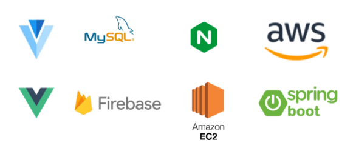

# **🏠[ 키코런](https://k3a506.p.ssafy.io/)** 
> Kid + Economy + Learn 
> <br>
> 어린이를 위한 쉽고 간편한 경제체험 서비스


## **✏️ Overview** 

> 어릴 때의 경제 습관을 길들여야 한다는 경제 전문가들의 분석 결과가 존재한다. 하지만, 맞벌이 부부의 경우 자녀의 경제 습관 혹은 지식을 기르기 위해 시간을 내기가 힘들다. 또한, 부모와 자녀가 동시에 사용할 수 있는 컨텐츠 부족으로 시작하기 쉽지 않다. 이를 위해, 쉽고 간편한 경제교육 서비스를 만들었다.


## **⚙️ Install and Usage**

### Requirements

---

### frontend
**/frontend/.env**
``` properties
VUE_APP_API_URL=
VUE_APP_OAUTH_KAKAO_CLIENT_ID=
VUE_APP_OAUTH_KAKAO_CLIENT_SECRET=
VUE_APP_OAUTH_KAKAO_REDIRECTION_URI=

VUE_APP_PUBLIC_VAPID_KEY=
VUE_APP_API_KEY=
VUE_APP_AUTH_DOMAIN=
VUE_APP_DATABASE_URL=
VUE_APP_PROJECT_ID=
VUE_APP_STORAGE_BUCKET=
VUE_APP_MESSAGE_SENDER_ID=
VUE_APP_APP_ID=
VUE_APP_MEASUREMENT_ID=

VUE_APP_BUCKET_NAME=
VUE_APP_BUCKET_REGION=
VUE_APP_IDENTITY_POOL_ID=
VUE_APP_S3_BASE_URL=
```

### backend
**/api/src/main/resources/application-properties**
``` properties
#database
spring.datasource.driver-class-name=com.mysql.cj.jdbc.Driver
spring.datasource.url=
spring.datasource.username=
spring.datasource.password=

#mybatis
mybatis.config-location=classpath:/mybatis/mybatis_config.xml
mybatis.configuration.return-instance-for-empty-row=true

#port
server.port=

#jwt
jwt.expmin=
jwt.salt=

#fcm
fcm.server-key=
custom.server-url=
```

### Project setup

---

#### frontend
``` sh
cd frontend
yarn install
yarn serve
```

#### backend
``` sh
cd api
mvn package
```

## **⭐ Main Service**

### **1. Quest**

> 오늘의 퀘스트 제공과 달성

- 부모페이지
    - 자녀의 퀘스트를 직접 등록 / 수정
    - 자녀 별 퀘스트 할당 가능
    - 자녀의 퀘스트 승인 요청시 알림 기능
- 자녀페이지
    - 오늘의 퀘스트를 확인하고 수행
    - 퀘스트 완료시 부모에게 알림 전송
    - 퀘스트 완료시 해당 퀘스트의 리워드 포인트 지급

### **2. Store**

> 부모가 올린 상품을 아이의 포인트로 구매

- 부모페이지
    - 자녀의 상품을 등록 / 수정 가능
    - 자녀 별 상품 할당 가능
    - 알림을 통해 자녀가 어떤 상품을 구매하는지 알 수 있음
- 자녀페이지
    - 스토어에서 원하는 상품 구매 가능
    - 원하는 상품 찜 기능
    - 해당 상품은 구매 요구 조건을 만족하면 구매 가능
    - 구매시, 부모에게 알림 전송

### **3. Quiz**

> 매일 새로운 퀴즈 제공을 통한 경제 상식 UP

- 부모페이지
    - 자녀에게 제공할 퀴즈 추가 가능
    - 자녀의 퀴즈 결과 제공
- 자녀페이지
    - 매일 새롭게 제공되는 퀴즈를 통해서 경제 상식 UP
    - 퀴즈를 푼 뒤, 문제에 대한 설명을 볼 수 있음
    - 퀴즈를 통해 리워드 포인트 받을 수 있음

### **4. Report**

> 소비 패턴을 볼 수 있는 서비스

- 자녀의 소비 패턴(오늘, 이번주)과 잔액을 확인 가능


## **🔧 Tech Stack**




## **👪 Contributors**

| Name   | GitHub                                         | Role      |
| ------ | ---------------------------------------------- | --------- |
| 이진영 | [leejinzero](https://github.com/leejinzero)    | FullStack |
| 김형준 | [guswls](https://github.com/guswls)           | FullStack |
| 유현진 | [hyungjun268](https://github.com/hyungjun268) | FrontEnd  |
